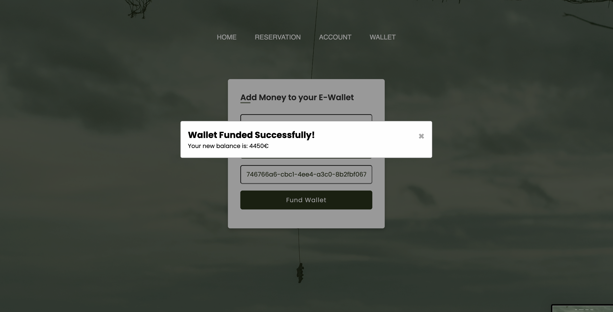
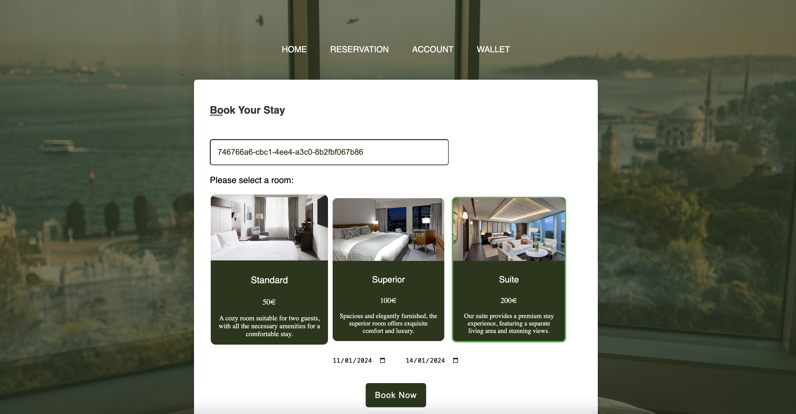
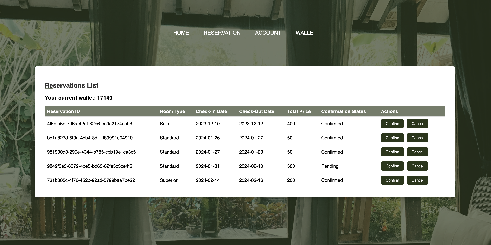

# Getting Started with Boundless Beds

Welcome to the Boundless Beds project! This guide will walk you through the steps to get the application up and running on your local development environment.

## Prerequisites

Before starting, ensure you have the following installed:

- Docker and Docker Compose
- IntelliJ IDEA (for running the Scala backend)
- SBT (Scala Build Tool) version corresponding to Scala 3
- Node.js (compatible with Angular 17)
- Angular CLI version 17

## Starting the Application

### Start the Database with Docker Compose

Navigate to the `boundless-beds` directory:

    cd boundless-beds

Run the following command to start the PostgreSQL database using Docker Compose:

    docker-compose up

This command will start the PostgreSQL database container as defined in your `docker-compose.yml` file.

### Start the Scala Backend Server

To start the backend server, you have two options:

#### Option 1: Using IntelliJ IDEA

1. Open the `boundless-beds` project in IntelliJ IDEA.
2. Use the built-in SBT shell or IntelliJ's Run configurations to start the server.

#### Option 2: Using SBT from the Terminal

1. In the terminal, navigate to the `boundless-beds` project directory.
2. Run the following SBT commands:

   sbt build
   sbt run

This will build and run the Scala backend server.

### Start the Angular Frontend

Navigate to the `boundless-beds-front` directory:

    cd boundless-beds-front

Run the Angular development server with the following command:

    ng serve --proxy-config proxy.conf.json

This command will start the Angular development server and set up the proxy configuration as specified in `proxy.conf.json`.

## Verify the Setup

After following the above steps:

- The database should be accessible on the default PostgreSQL port `5432`.
- The Scala backend server should be running and accessible from port `8080`.
- The Angular frontend should be available at `http://localhost:4200`.

# Boundless Beds Web Application Demo

## Home Page

The home page showcases a grand, inviting visual with clear navigation options for Home, Reservation, Account,[ddd.md](..%2Ftodo%2Fddd.md) and Wallet. The prominent call-to-action button "Start Your Journey" encourages users to engage with the booking services offered.

## User Registration

This page is designed for new users to create their account. It provides a simple and straightforward form to enter personal details such as full name, email, and french phone number starting with +336.

## Account Creation Confirmation

Upon successful registration, users are greeted with a confirmation message displaying their unique Account ID. This screen reinforces the success of the account creation process.

## Wallet Top-Up

This interface allows users to add funds to their e-wallet, which can be used to make reservations. It supports multiple currencies, enhancing the application's usability for international users.

## Wallet Funding Success

Post successful transaction, the system provides immediate feedback on the new wallet balance, ensuring users are aware of their updated funds.

## Booking Interface

The booking page presents users with a sleek, easy-to-use interface to select room types and dates, streamlining the reservation process.

## Reservation Management

Users can view and manage their bookings through the reservations list, which displays detailed information and allows for actions such as confirmation or cancellation.

---
**Strategic Design**

1. **Ubiquitous Language**:

   - **Account**: The profile a client creates to use the hotel services, containing the client's full name, email address, and phone number.
   - **Wallet**: An electronic payment system unique to the XYZ Hotel, where clients load money and make payments for their reservations.
   - **Currency**: A function to convert various accepted foreign currencies into Euros to maintain wallet balance in Euros.
   - **Room**: Data related to the different types of rooms available for reservation.
   - **Reservation**: The action where a client selects a room type, check-in date, and duration of stay. Payment of 50% of the total amount is required upon reservation.

2. **Bounded Contexts**: Create a diagram representing all the business contexts.
   - Account Management
   - Wallet Management
   - Reservation Management

3. **Context Maps**: Complete the bounded contexts diagram with relationships between contexts.
   - Account Management ↔ Wallet Management
   - Account Management ↔ Reservation Management
   - Room Information View ↔ Reservation Management

4. **Core/Supporting/Generic domains**: Identify the core, supporting, and generic domains of your system.
   - **Core Domain**: Reservation Management
   - **Supporting Domains**: Account Management and Wallet Management
   - **Generic Domains**: Room Information View

**Functionalities**

1. **Create an Account**:
   - Clients must create an account to make reservations.
   - Clients will provide their full name, unique email address, and phone number.
   - In return, the system will provide a randomly generated identifier, required for accessing hotel services via the system.

2. **Top Up Wallet**:
   - Payments are made exclusively through an electronic wallet.
   - Clients can load their wallets.
   - Accepted currencies: Euro, Dollar, Pound Sterling, Yen, and Swiss Franc.
   - Wallet balance is maintained in Euros, requiring currency conversion when necessary.

3. **View Room Information**:
   - Clients can view room details before making a reservation.
   - Room types: Standard (50€/night), Superior (100€/night), Suite (200€/night). Each type has various amenities like WiFi, TV, etc.

4. **Make a Reservation**:
   - Clients can book rooms by choosing the check-in date, number of nights, and desired room type.
   - Upon reservation, the client's wallet is debited by 50% of the total amount. The remaining amount is paid on the day of check-in.

5. **Confirm a Reservation**:
   - To confirm a reservation, the client must pay the remaining 50%.
   - The check-in date is not considered, and confirmation can be made post the check-in date.
